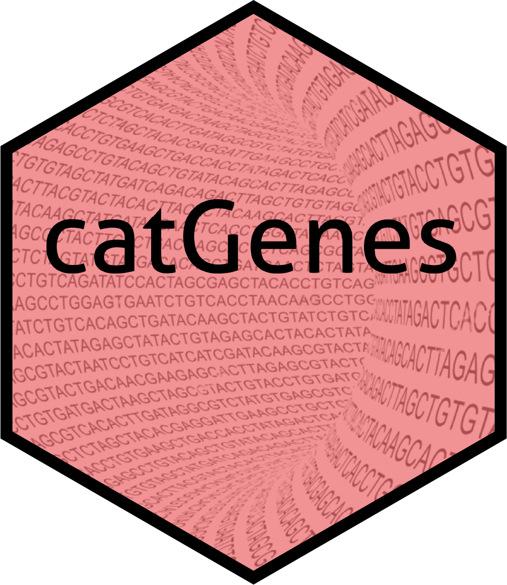
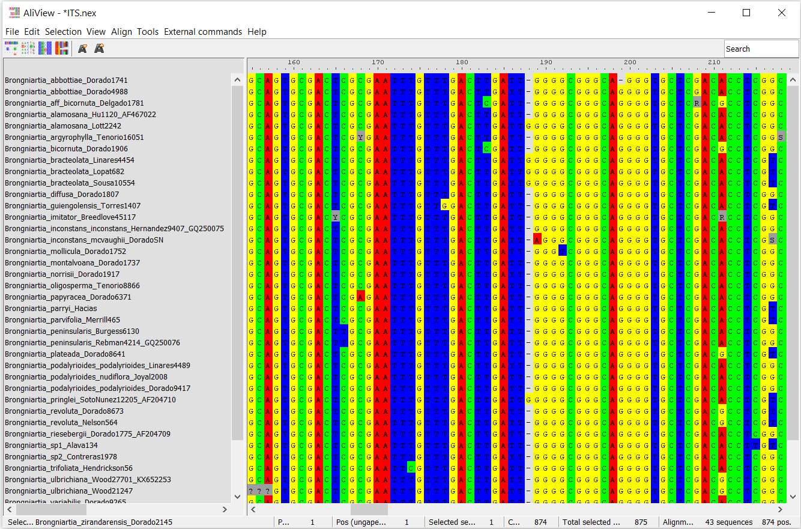
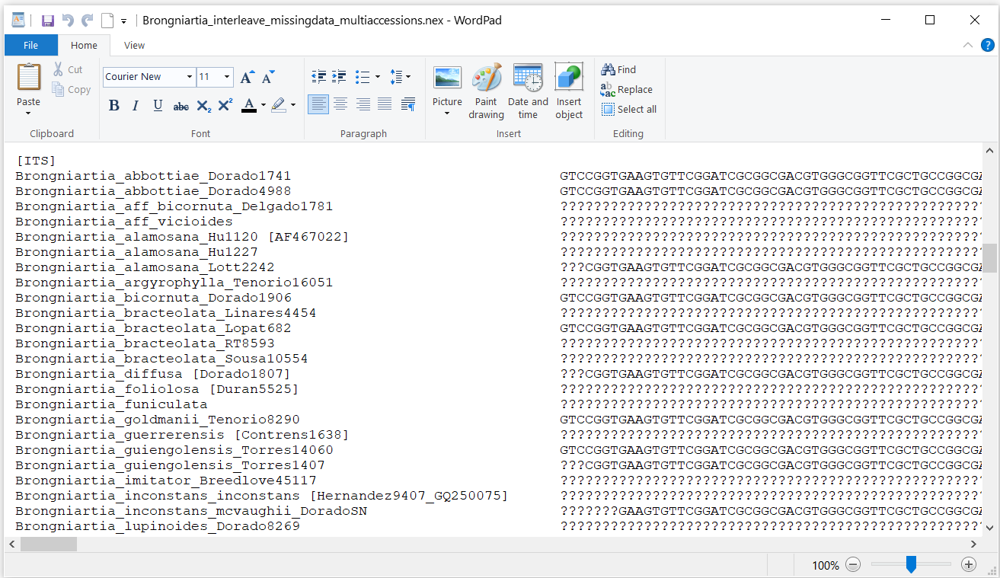
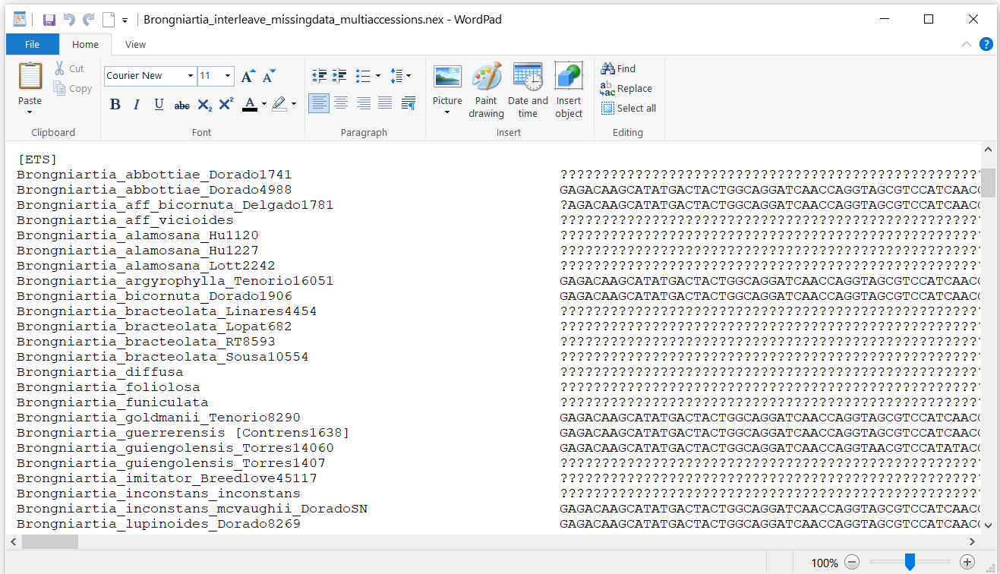
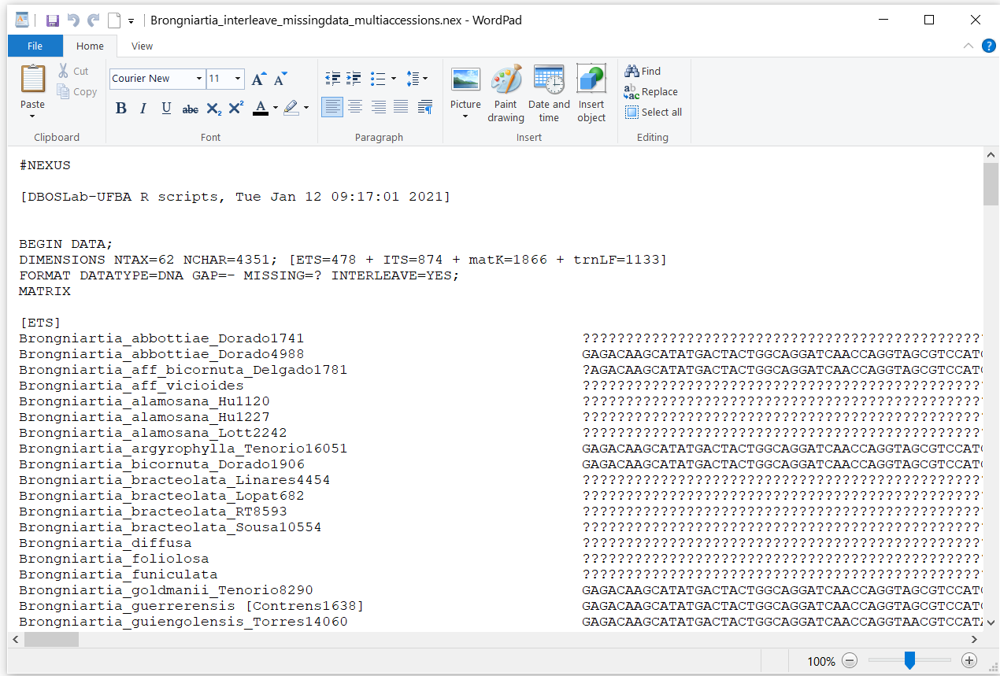

<!-- README.md is generated from README.Rmd. Please edit that file -->

```{r, include = FALSE}
knitr::opts_chunk$set(
  collapse = TRUE,
  comment = "#>",
  fig.path = "man/figures/README-",
  out.width = "100%"
)
```

# catGenes 

<!-- badges: start -->
<!-- badges: end -->

The _catGenes_ package is intended to help researchers in phylogenetics and phylogenomics to build a fully concatenated or combined (non-interleaved) dataset by automatically comparing individual DNA alignments. The user can concatenate the multiple DNA matrices by either running the _catGenes_ functions in [R environment ](https://www.r-project.org/) or using an interactive [Shiny app](https://shiny.rstudio.com/).

## Installation

You can install the development version from [GitHub](https://github.com/) with:

``` r
# install.packages("devtools")
devtools::install_github("domingoscardoso/catGenes")
```
## Standard format for input DNA alignments

### _Formatting sequences with scientific names and accession identifiers_

The concatenating functions available in _catGenes_ work by comparing the scientific names across the individual DNA alignments, when the input matrices do 
not have species duplicated with multiple accessions. If the species are duplicated then the concatenating comparison will consider both the scientific names and an associated unique identifier (e.g. the collector number provided right after the taxon names). As such, before loading the DNA alignments and using any of the concatenating _catGenes_ functions, make sure the identification of the accessions across all DNA sequences is consistently formatted. So, depending on the input DNA alignments, they must be formatted as following:

#### _1. When the DNA alignments have just a single sequence per species_

The species/sequences may be simply named as __Genus_species__, just like the example below. The generic name could even be abbreviated but always keeping separated from the specific epithet like __G_species__. Note that the sequences may also be labeled by including "cf" or "aff" between the genus and specific epithet, but they must be separated by an underscore.


The species/sequences may also be named as __Genus_species_everythingelse__ or __G_species_everythingelse__, that is, the scientific name is separated by the accession identifier (e.g. collector surname and associated collection number). The "everything else" means that the sequence here may have as many identifiers as desired, provided that at least the scientific name is consistently formatted. For example, in addition to format the sequences just like in the example below, note that you could also format like __Vatairea_fusca_Cardoso2939_JX152598__. 


In brief, no matter the input DNA alignments have or not an associated identifier, the species/sequences should be consistently named, either with the genus name abbreviated or not, and always separated from the identifier(s) by an underscore.


#### _2. When the DNA alignments have any species duplicated with multiple accessions_
The _catGenes_ package has specific functions to concatenate the DNA alignments when any species are duplicated with multiple accessions, i.e. the species is represented by multiple sequences generated from different individuals. In this case, the concatenation will consider both the consistently-formatted scientific names and their associated unique identifiers. Then, the sequences/species must be formatted as __Genus_species_identifier_everythingelse__ or __G_species_identifier_everythingelse__, as exemplified below:


#### _3. Formatting labels for accessions identified just at genus level or fully identified with infraspecific taxa_

The accessions/sequences not fully identified or just at genus level should be simply named as __Genus_sp__, or __Genus_sp1__ and __Genus_sp2__, or __Genus_spA__ and __Genus_spB__, just like the example below. The generic name could even be abbreviated but always keeping separated from the "sp" and always without full period  like __G_sp__ or __G_sp1__ or __G_spA__. It is also possible to run any of the concatenating _catGenes_ functions even when when accesions are fully identified with infraspecific taxa. Following the same general formatting scheme for accessions idenfitied at species level, just add the infraspecific taxa after the specific epithet such as __Genus_species_variety_identifier_everythingelse__ or __Genus_species_subspecies_identifier_everythingelse__, but do not mention wheather they are "var"  or "subsp". See also some examples below:




### _Naming the individual DNA alignment files_
Before loading the individual DNA alignments for concatenation, we recommend that each file is simply named with the corresponding gene names and do not use space or hyphen to separate the file name. For example: __ITS.nex__, __rbcL.nex__, __psbAtrnH.nex__, __COX1.nex__, etc. This is the best way to name the input files if you want to run _catGenes_ using the Shiny app. Also, it facilitates to load all DNA alignments by just using a _for_ loop that will create a list of the input genes ready for the concatenation. Note that we load the DNA alignments by using [_ape_](https://www.rdocumentation.org/packages/ape/versions/5.4-1)'s function [read.nexus.data](https://www.rdocumentation.org/packages/ape/versions/5.4-1/topics/read.nexus.data). 
See below an example using the available DNA alignments of the Vataireoid legumes 
that are stored within the _catGenes_ directory:

```{r, message=FALSE, warning=FALSE}
library(catGenes)

# Loading all individual DNA alignments for the concatenation
genes <- list.files(system.file("DNAlignments/Vataireoids", 
                                package = "catGenes"))
Vataireoids <- list()
for (i in genes){
  Vataireoids[[i]] <- ape::read.nexus.data(system.file("DNAlignments/Vataireoids", i, 
                                                       package = "catGenes"))
}
names(Vataireoids) <- gsub("[.].*", "", names(Vataireoids))
```

The created object __Vataireoids__ is a list of all input individual DNA alignments ready for the concatenation by using the available _catGenes_ functions. As you can see below, the containing input DNA alignments within the Vataireoids list are named exactly how the files were originally named:
```{r}
names(Vataireoids)
```

Note that in your computer the individual DNA alignments could be loaded into a single list by adjusting the abovementioned code as follows:

```{r, eval=FALSE}
library(catGenes)

genes <- list.files("path_to_DNA_alignments_folder")
Vataireoids <- list()
for (i in genes){
  Vataireoids[[i]] <- ape::read.nexus.data(paste0("path_to_DNA_alignments_folder/", i))
}
names(Vataireoids) <- gsub("[.].*", "", names(Vataireoids))
```

If the input individual DNA alignments have any identifier associated to the gene names, like __Vataireoids_ITS.nex__, __Vataireoids_matK.nex__, __Vataireoids_trnDT.nex__, etc., then you can load all such files by either importing each DNA alignment separately or by adjusting the abovementioned _for_ loop as follows:

```{r, eval=FALSE}
library(catGenes)

# Loading each DNA alignment from the working directory separately by using the
# ape's function read.nexus.data
ITS <- read.nexus.data("Vataireoids_ITS.nex")
matK <- read.nexus.data("Vataireoids_matK.nex")
trnDT <- read.nexus.data("Vataireoids_trnDT.nex")

# Loading just the Vataireoid DNA alignments even if there are other DNA alignments 
# in the same working directory
genes <- list.files("path_to_DNA_alignments_folder")
Vataireoids <- list()
for (i in genes[grepl("Vataireoids", genes)]){
  Vataireoids[[i]] <- ape::read.nexus.data(paste0("path_to_DNA_alignments_folder/", i))
}
# Deleting all characters between "Vataireoids_" and ".nex" so as to keep just the
# name of the genes in the vataireoids list of named DNA alignments
names(Vataireoids) <- gsub(".*_(.+)[.].*", "\\1", names(Vataireoids))
```


## Basic Usage

### _Loading the DNA matrices and running the concatenation_
```{r, message=FALSE, warning=FALSE}
library(catGenes)

# Loading all individual DNA alignments for the concatenation
genes <- list.files(system.file("DNAlignments/Vataireoids", 
                                package = "catGenes"))

# For simplicity, this example will include just three DNA matrices
Vataireoids <- list()
for (i in genes[1:3]){
  Vataireoids[[i]] <- ape::read.nexus.data(system.file("DNAlignments/Vataireoids", i, 
                                                       package = "catGenes"))
}
names(Vataireoids) <- gsub("[.].*", "", names(Vataireoids))

# Running the concatenating analysis
# Note that the main steps during concatenation will be printed in the R console
catdf <- catfullGenes(Vataireoids,
                      shortaxlabel = TRUE,
                      missdata = TRUE)

```

### _Writing the concatenated matrix in NEXUS format_

This new function __writeNexus__ will write a NEXUS-formatted combined dataset with each individual gene alignment as interleaved and including a preliminary [MrBayes](http://nbisweden.github.io/MrBayes/) command block, including the charset of each partition. Note that you may choose to concatenate the DNA alignments as non-interleaved and without the charset at the end of the matrix block.
```{r, message=FALSE, warning=FALSE}
writeNexus(catdf, 
           file = "Vataireoids.nex",
           genomics = FALSE,
           interleave = TRUE,
           bayesblock = TRUE)
```

See below a screenshot of the beggining of the NEXUS-formatted concatenated matrix:


See below a screenshot of the end of the NEXUS-formatted concatenated matrix, showing the charset of each partition:


### _How the function writeNexus handles differing identifers when concatenating DNA alignments by keeping all original identifiers_
It is possible to run the concatenating _catGenes_ functions so as to get a concatenated matrix that keeps all original identifiers in each individual partition (i.e. choosing the argument shortaxlabel = FALSE when running __catfullGenes__ or __catmultGenes__). But as shown in the next two screenshots below, note that the function __writeNexus__ will handle the with differing identifers across partitions by keeping them as comments inside brackets.






### _Writing the concatenated matrix in PHYLIP format_
This new function __writePhylip__ will write both a PHYLIP-formatted concatenated matrix and an associated partition file for [RAxML](https://cme.h-its.org/exelixis/web/software/raxml/index.html) concatenated phylogenetic analysis using a mixed/partitioned model, as available in [CIPRES](http://www.phylo.org/).
```{r, message=FALSE, warning=FALSE}
writePhylip(catdf, 
            file = "Vataireoids_dataset.phy",
            genomics = FALSE,
            catalignments = TRUE,
            partitionfile = TRUE)

```

See below a screenshot of the PHYLIP-formatted concatenated matrix:


See below a screenshot of the partition file to be uploaded in CIPRES for a RAxML concatenated phylogenetic analysis using a mixed/partitioned model:


### _Removing duplicated accessions of the same species in DNA alignments_
This function __dropSeq__ will remove the smaller sequence(s) (with missing characters, either "?" or "N") for any species duplicated with multiple accessions in the DNA alignment. The next screenshot below show a concatenated dataset after run with __catmultGenes__, where there are species duplicated with multiple accessions. Before writing such a concatenated dataset with the function __writeNexus__, for example, it is possible to run the function __dropSeq__ so as to remove the duplicated accessions of the same species.



Note below that the function __dropSeq__ removed all multiple accessions of the same species from the previous concatenated dataset:


### _Performance of catGenes with large, genomic datasets_
The concatenating _catGenes_ functions have been developed to perform efficiently  also with large datasets for phylogenomic analyses. See below some screenshots of a NEXUS-formatted concatenated matrix after running the function __catmultGenes__ with a list of 78 protein coding plastid genes for 122 species, as originally published by [Gonçalves et al. (2020)](https://bsapubs.onlinelibrary.wiley.com/doi/abs/10.1002/ajb2.1502) when investigating the historical biogeography of Vochysiaceae across the Neotropics. The original data retrieved from [Dryad](https://doi.org/10.5061/dryad.sn02v6x1g) repository were also kindly permitted by [Deise Gonçalves](http://www.deisegoncalves.com/) to be used as example genomic data of the _catGenes_ package.


## Documentation
A detailed description of the _catGenes_' full functionality will soon be available in [here](https://github.com/domingoscardoso/catGenes/tree/main/vignettes/).


## Shiny App
The _catGenes_ package also comes with a Shiny app that can be called by using the following command:
```{r, eval=FALSE}
run_catGenes()
```
Below some screenshots of the _catGenes_ application that will open automatically in the default internet browser, or the viewer if running from [RStudio](https://rstudio.com/).


## Citation
Cardoso, D. & Cavalcante, Q. (2024). catGenes: a new R package for combining multiple DNA alignments for multigene analysis in phylogenetics and phylogenomics. https://github.com/domingoscardoso/catGenes
