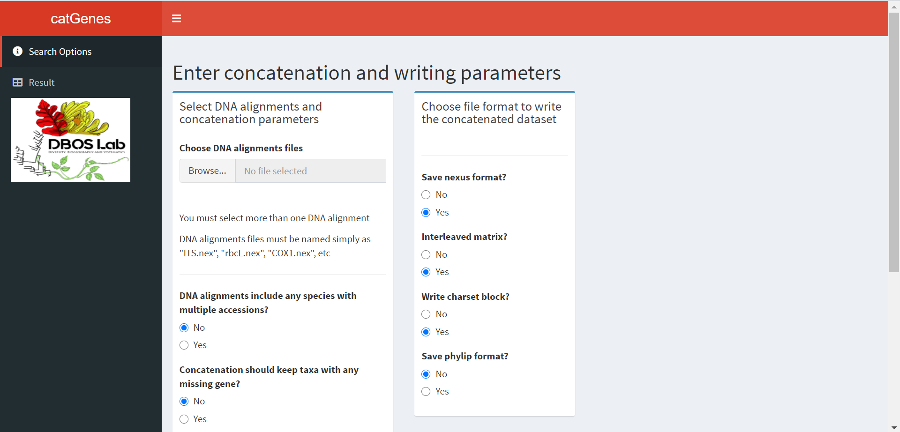

<!-- README.md is generated from README.Rmd. Please edit that file -->

# catGenes

<!-- badges: start -->

<!-- badges: end -->

The *catGenes* package is intended to help researchers in phylogenetics
and phylogenomics to build a fully concatenated or combined
(non-interleaved) dataset by automatically comparing individual DNA
alignments. The user can concatenate the multiple DNA matrices by either
running the *catGenes* functions in [R
environment](https://www.r-project.org/) or using an interactive [Shiny
app](https://shiny.rstudio.com/).

## Installation

You can install the development version from
[GitHub](https://github.com/) with:

``` r
# install.packages("devtools")
devtools::install_github("domingoscardoso/catGenes")
```

## Standard format for input DNA alignments

### *Formatting sequences with scientific names and accession identifiers*

The concatenating functions available in *catGenes* work by comparing
the scientific names across the individual DNA alignments, when the
input matrices do not have species duplicated with multiple accessions.
If the species are duplicated then the concatenating comparison will
consider both the scientific names and an associated unique identifier.
As such, before loading the DNA alignments and runing *catGenes*
concatenating functions, make sure they have the sequences consistently
formatted. Depending on the input DNA alignments, the matrices must be
formatted as following:

#### *1. When the DNA alignments have just a single sequence per species*

The species/sequences may be simply named as **Genus\_species**, just
like the example below. The generic name could even be abbreviated but
always keeping separated from the specific epithet like **G\_species**.
Note that the sequences may also be labeled by including “cf” or “aff”
between the genus and specific epithet, but they must be separated by an
underscore.


The species/sequences may also be named as
**Genus\_species\_everythingelse** or **G\_species\_everythingelse**,
that is, the scientific name is separated by the accession identifier
(e.g. collector surname and associated collection number). The
“everything else” means that the sequence here may have as many
identifiers as desired, provided that at least the scientific name is
consistently formatted. For example, in addition to format the sequences
just like in the example below, note that you could also format like
**Vatairea\_fusca\_Cardoso2939\_JX152598**.


In brief, no matter the input DNA alignments have or not an associated
identifier, the species/sequences should be consistently named, either
with the genus name abbreviated or not, and always separated from the
identifier(s) by an underscore.

#### *2. When the DNA alignments have any species duplicated with multiple accessions*

The *catGenes* package has specific functions to concatenate the DNA
alignments when any species are duplicated with multiple accessions,
i.e. the species is represented by multiple sequences generated from
different individuals. In this case, the concatenation will consider
both the consistently-formatted scientific names and their associated
unique identifiers. Then, the sequences/species must be formatted as
**Genus\_species\_identifier\_everythingelse** or
**G\_species\_identifier\_everythingelse**, as exemplified below:


### *Naming the individual DNA alignment files*

Before loading the individual DNA alignments for concatenation, we
recommend that each file is simply named with the corresponding gene
names and do not use space or hyphen to separate the file name. For
example: **ITS.nex**, **rbcL.nex**, **psbAtrnH.nex**, **COX1.nex**, etc.
This is the best way to name the input files if you want to run
*catGenes* using the Shiny app. Also, it facilitates to load all DNA
alignments by just using a *for* loop that will create a list of the
input genes ready for the concatenation. Note that we load the DNA
alignments by using
[*ape*](https://www.rdocumentation.org/packages/ape/versions/5.4-1)’s
function
[read.nexus.data](https://www.rdocumentation.org/packages/ape/versions/5.4-1/topics/read.nexus.data).
See below an example using the available DNA alignments of the
Vataireoid legumes that are stored within the *catGenes* directory:

``` r
library(catGenes)

# Loading all individual DNA alignments for the concatenation
genes <- list.files(system.file("DNAlignments/Vataireoids", 
                                package = "catGenes"))
Vataireoids <- list()
for (i in genes){
  Vataireoids[[i]] <- ape::read.nexus.data(system.file("DNAlignments/Vataireoids", i, 
                                                       package = "catGenes"))
}
names(Vataireoids) <- gsub("[.].*", "", names(Vataireoids))
```

The created object **Vataireoids** is a list of all input individual DNA
alignments ready for the concatenation by using the available *catGenes*
functions. As you can see below, the containing input DNA alignments
within the Vataireoids list are named exactly how the files were
originally named:

``` r
names(Vataireoids)
#> [1] "ETS"      "ITS"      "matK"     "psbAtrnH" "rpS16"    "trnDT"    "trnL"    
#> [8] "trnQ"
```

Note that in your computer the individual DNA alignments could be loaded
into a single list by adjusting the abovementioned code as follows:

``` r
library(catGenes)

genes <- list.files("path_to_DNA_alignments_folder")
Vataireoids <- list()
for (i in genes){
  Vataireoids[[i]] <- ape::read.nexus.data(paste0("path_to_DNA_alignments_folder/", i))
}
names(Vataireoids) <- gsub("[.].*", "", names(Vataireoids))
```

If the input individual DNA alignments have any identifier associated to
the gene names, like **Vataireoids\_ITS.nex**,
**Vataireoids\_matK.nex**, **Vataireoids\_trnDT.nex**, etc., then you
can load all such files by either importing each DNA alignment
separately or by adjusting the abovementioned *for* loop as follows:

``` r
library(catGenes)

# Loading each DNA alignment from the working directory separately by using the
# ape's function read.nexus.data
ITS <- read.nexus.data("Vataireoids_ITS.nex")
matK <- read.nexus.data("Vataireoids_matK.nex")
trnDT <- read.nexus.data("Vataireoids_trnDT.nex")

# Loading just the Vataireoid DNA alignments even if there are other DNA alignments 
# in the same working directory
genes <- list.files("path_to_DNA_alignments_folder")
Vataireoids <- list()
for (i in genes[grepl("Vataireoids", genes)]){
  Vataireoids[[i]] <- ape::read.nexus.data(paste0("path_to_DNA_alignments_folder/", i))
}
# Deleting all characters between "Vataireoids_" and ".nex" so as to keep just the
# name of the genes in the vataireoids list of named DNA alignments
names(Vataireoids) <- gsub(".*_(.+)[.].*", "\\1", names(Vataireoids))
```

## Basic Usage

### *Loading the DNA matrices and running the concatenation*

``` r
library(catGenes)

# Loading all individual DNA alignments for the concatenation
genes <- list.files(system.file("DNAlignments/Vataireoids", 
                                package = "catGenes"))

# For simplicity, this example will include just three DNA matrices
Vataireoids <- list()
for (i in genes[1:3]){
  Vataireoids[[i]] <- ape::read.nexus.data(system.file("DNAlignments/Vataireoids", i, 
                                                       package = "catGenes"))
}
names(Vataireoids) <- gsub("[.].*", "", names(Vataireoids))

# Running the concatenating analysis
# Note that the main steps during concatenation will be printed in the R console
catdf <- catfullGenes(Vataireoids,
                      shortaxlabel = TRUE,
                      missdata = TRUE)
#> Matching first the gene ETS with: ITS... matK...
#> 
#> Gene comparison will exclude sequence set from ETS that is not in ITS...
#> 
#> Gene comparison will include missing data into ETS
#> 
#> PS. The resulting dataset will have sequences sorted alphabetically by taxon.
#> 
#> Shortening taxon labels...
#> 
#> Match between ETS and ITS is finished!
#> 
#> Gene comparison will exclude sequence set from ETS that is not in matK...
#> 
#> Gene comparison will include missing data into ETS
#> 
#> PS. The resulting dataset will have sequences sorted alphabetically by taxon.
#> 
#> Shortening taxon labels...
#> 
#> Match between ETS and matK is finished!
#> 
#> Matched result of gene ETS is again matched with ITS... matK...
#> 
#> Gene comparison will exclude sequence set from ITS that is not in the matched result of ETS...
#> 
#> Gene comparison will include missing data into ETS
#> 
#> PS. The resulting dataset will have sequences sorted alphabetically by taxon.
#> 
#> Shortening taxon labels...
#> 
#> Match between ETS and ITS is finished!
#> 
#> Gene comparison will exclude sequence set from matK that is not in the matched result of ETS...
#> 
#> Gene comparison will include missing data into ETS
#> 
#> PS. The resulting dataset will have sequences sorted alphabetically by taxon.
#> 
#> Shortening taxon labels...
#> 
#> Match between ETS and matK is finished!
#> 
#> Full gene match is finished!
```

### *Writing the concatenated matrix in NEXUS format*

This new function **writeNexus** will write a NEXUS-formatted combined
dataset with each individual gene alignment as interleaved and including
a preliminary [MrBayes](http://nbisweden.github.io/MrBayes/) command
block, including the charset of each partition. Note that you may choose
to concatenate the DNA alignments as non-interleaved and without the
charset at the end of the matrix block.

``` r
writeNexus(catdf, 
           file = "Vataireoids.nex",
           bayesblock = TRUE, 
           interleave = TRUE)
#> You are combining the following gene datasets:
#> 
#> ETS, ITS, matK
#> 
#> Total number of datasets: 3
#> 
#> Your final dataset will have these DIMENSIONS:
#> 
#> NCHAR=3125; [ETS=426 + ITS=830 + matK=1869]
#> 
#> NTAX=33
#> 
#> Combining genes as interleave...
#> 
#> Building a preliminary Mr.Bayes command block...
#> 
#> Gene concatenation is finished!
```

See below a screenshot of the beggining of the NEXUS-formatted
concatenated matrix:


See below a screenshot of the end of the NEXUS-formatted concatenated
matrix, showing the charset of each partition:


### *Writing the concatenated matrix in PHYLIP format*

This new function **writePhylip** will write both a PHYLIP-formatted
concatenated matrix and an associated partition file for
[RAxML](https://cme.h-its.org/exelixis/web/software/raxml/index.html)
concatenated phylogenetic analysis using a mixed/partitioned model, as
available in [CIPRES](http://www.phylo.org/).

``` r
writePhylip(catdf, 
            file = "Vataireoids_dataset.phy",
            catalignments = TRUE,
            partitionfile = TRUE)
#> You are combining the following gene datasets:
#> 
#> ETS, ITS, matK
#> 
#> Total number of datasets: 3
#> 
#> Your phylip-formatted concantenated dataset will have the following DIMENSIONS:
#> 
#> 33 TAXA
#> 3125 CHARACTERS
#> Concatenating the genes...
#> 
#> Gene concatenation is finished!
```

See below a screenshot of the PHYLIP-formatted concatenated matrix:


See below a screenshot of the partition file to be uploaded in CIPRES
for a RAxML concatenated phylogenetic analysis using a mixed/partitioned
model:


## Documentation

A detailed description of the *catGenes*’ full functionality will soon
be available in
[here](https://github.com/domingoscardoso/catGenes/tree/main/vignettes/).

## Shiny App

The *catGenes* package also comes with a Shiny app that can be called by
using the following command:

``` r
run_catGenes()
```

Below some screenshots of the *catGenes* application that will open
automatically in the default internet browser, or the viewer if running
from [RStudio](https://rstudio.com/).




## Citation

Cardoso, D., Cavalcante, Q. & Vilela, B. (2020). catGenes: a new R
package for combining multiple DNA alignments for multigene analysis in
phylogenetics and phylogenomics.
<https://github.com/domingoscardoso/catGenes>
