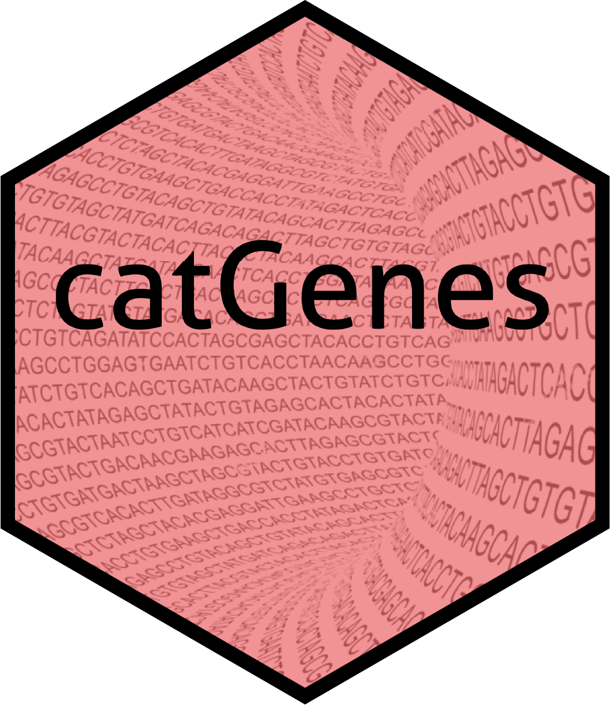
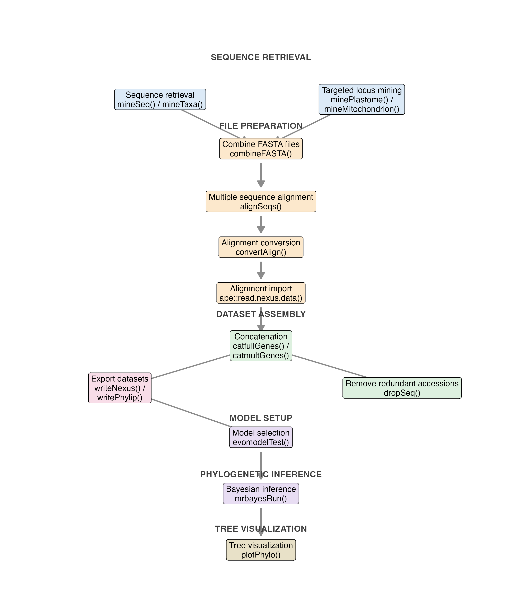

<!-- README.md is generated from README.Rmd. Please edit that file -->

# catGenes 

**Tools for DNA sequence retrieval, alignment, concatenation, and
phylogenetic analysis in R**

<!-- badges: start -->

[](https://app.codecov.io/gh/DBOSlab/catGenes)
[](https://github.com/DBOSlab/catGenes/actions/workflows/test-coverage.yaml)
[](https://cran.r-project.org/package=catGenes)
[](https://github.com/DBOSlab/catGenes/actions/workflows/R-CMD-check.yaml)
[](LICENSE)
<!-- badges: end -->

`catGenes` provides tools in the [R
environment](https://www.r-project.org/) for assembling, standardizing,
and analyzing multilocus DNA datasets for phylogenetic and phylogenomic
research. Although originally developed for concatenating multiple DNA
alignments, the package now includes a broader set of functions for
sequence retrieval from GenBank, combining FASTA files, automated
multiple sequence alignment, alignment conversion, partitioned dataset
export, evolutionary model selection, MrBayes workflow preparation and
execution, and phylogenetic tree visualization.

The package is intended to support reproducible workflows from sequence
retrieval and alignment processing to phylogenetic inference and tree
visualization.

## Main features

`catGenes` currently includes functions for:

- retrieving DNA sequences from GenBank using accession numbers
- retrieving DNA sequences from GenBank using taxonomic queries
- mining targeted loci from plastid and mitochondrial genomes
- combining multiple `FASTA` files into a single file
- performing automated multiple sequence alignment
- converting alignments among `NEXUS`, `FASTA`, and `PHYLIP` formats
- comparing and concatenating multiple DNA alignments
- handling datasets with single sequences per species or multiple
  accessions per species
- writing concatenated datasets in `NEXUS` and `PHYLIP` formats with
  partition information
- selecting evolutionary models for phylogenetic analysis
- generating partitioned `MrBayes` command blocks
- running `MrBayes` directly from R
- plotting edited phylogenetic trees with `ggtree`

## Installation

You can install the development version from
[GitHub](https://github.com/) with:

``` r
# install.packages("devtools")
devtools::install_github("DBOSlab/catGenes")
```

## Input data

Most `catGenes` workflows start from DNA sequences or individual DNA
alignments. Depending on the function, inputs may include GenBank
accession tables, FASTA files, or alignments in NEXUS, FASTA, or PHYLIP
format. For concatenation functions, taxon labels should be consistently
formatted across loci.

In general:

- datasets with a single sequence per species can use labels such as
  `Genus_species`
- datasets with multiple accessions per species should include a stable
  identifier after the taxon name
- alignment file names are best kept simple and informative, usually
  matching the gene or locus name

A more detailed guide to sequence-label formatting, duplicated
accessions, and naming conventions can be provided in dedicated
articles.

## General workflow

A typical `catGenes` workflow may involve some or all of the following
steps:

1.  retrieve sequences from GenBank or mine loci from organellar genomes
2.  combine FASTA files when needed
3.  perform automated multiple sequence alignment
4.  convert alignments among standard file formats
5.  compare taxa across loci and build equally sized gene datasets
6.  write concatenated matrices in NEXUS or PHYLIP format
7.  select substitution models and prepare partition information
8.  run phylogenetic analyses
9.  visualize and edit resulting trees

## Typical phylogenetic workflow with `catGenes`

The diagram below summarizes a typical `catGenes` workflow, from
sequence retrieval and alignment preparation to concatenation, model
selection, phylogenetic inference, and tree visualization.



*Overview of the main `catGenes` workflow, highlighting sequence
retrieval, FASTA combination, sequence alignment, alignment conversion,
concatenation, export of partitioned datasets, model selection,
phylogenetic inference, and tree visualization.*

## Basic example

### Load example DNA alignments

``` r
library(catGenes)

genes <- list.files(system.file("DNAlignments/Vataireoids",
                                package = "catGenes"))

Vataireoids <- list()
for (i in genes[1:3]) {
  Vataireoids[[i]] <- ape::read.nexus.data(
    system.file("DNAlignments/Vataireoids", i, package = "catGenes")
  )
}
names(Vataireoids) <- gsub("[.].*", "", names(Vataireoids))
```

### Compare loci and prepare a concatenated dataset

Use `catfullGenes()` when each species is represented by a single
sequence per locus.

``` r
catdf <- catfullGenes(
  Vataireoids,
  shortaxlabel = TRUE,
  missdata = TRUE
)
```

When species are represented by multiple accessions across one or more
alignments, use `catmultGenes()` instead.

### Write a concatenated NEXUS matrix

``` r
writeNexus(
  catdf,
  file = "Vataireoids.nex",
  genomics = FALSE,
  interleave = TRUE,
  bayesblock = TRUE
)
```

### Write a concatenated PHYLIP matrix and partition file

``` r
writePhylip(
  catdf,
  file = "Vataireoids_dataset.phy",
  genomics = FALSE,
  catalignments = TRUE,
  partitionfile = TRUE
)
```

## Other key functions

Beyond concatenation, `catGenes` includes several additional tools that
can be combined into a broader phylogenetic workflow.

### Retrieve DNA sequences from GenBank

``` r
seqs <- mineSeq(
  inputdf = my_accession_table,
  gb.colnames = c("ITS", "matK", "rbcL")
)
```

### Mine sequences from GenBank using taxonomic queries

``` r
mineTaxa(
  term = "Leguminosae[Organism] AND matK[Gene]",
  retmax = 2000,
  clean_taxa = TRUE
)
```

### Combine multiple FASTA files

``` r
result <- combineFASTA(
  input_files = c("gene1.fasta", "gene2.fasta", "gene3.fasta"),
  output_file = "combined_sequences.fasta"
)
```

### Perform automated multiple sequence alignment

``` r
alignSeqs(
  filepath = "path_to_fasta_files",
  method = "ClustalW",
  format = "NEXUS"
)
```

### Convert alignment formats

``` r
convertAlign(
  filepath = "path_to_alignments",
  format = "FASTA"
)
```

### Mine loci from plastomes or mitochondrial genomes

``` r
minePlastome(
  genbank = c("NC_000000", "NC_000001"),
  genes = c("matK", "rbcL", "ndhF")
)

mineMitochondrion(
  genbank = c("NC_000000", "NC_000001"),
  genes = c("cox1", "nad1")
)
```

### Select evolutionary models and generate MrBayes blocks

``` r
evomodelTest(
  nexus_file_path = "Vataireoids.nex",
  model_criteria = "BIC"
)
```

### Run MrBayes from R

``` r
res <- mrbayesRun(
  nexus_file = "Vataireoids.nex",
  mrbayes_dir = "/path/to/mrbayes"
)
```

### Plot phylogenetic trees

``` r
plotPhylo(
  tree = my_tree,
  layout = "rectangular",
  branch.supports = TRUE,
  show.tip.label = TRUE
)
```

## Available functions

| Function | Main purpose |
|:---|:---|
| `mineSeq()` | Download DNA sequences from GenBank using accession numbers |
| `mineTaxa()` | Mine DNA sequences from GenBank using taxonomic queries |
| `minePlastome()` | Retrieve targeted loci from plastid genomes available in GenBank |
| `mineMitochondrion()` | Retrieve targeted loci from mitochondrial genomes available in GenBank |
| `combineFASTA()` | Combine multiple FASTA files into a single FASTA file |
| `alignSeqs()` | Perform automated multiple sequence alignment using supported alignment algorithms |
| `convertAlign()` | Convert alignments among NEXUS, FASTA, and PHYLIP formats |
| `catfullGenes()` | Compare and prepare multiple alignments for concatenation when each species has a single sequence per locus |
| `catmultGenes()` | Compare and prepare multiple alignments for concatenation when species may have multiple accessions |
| `dropSeq()` | Remove redundant or less informative duplicated accessions from concatenated datasets |
| `writeNexus()` | Export concatenated datasets in NEXUS format, optionally with partition information and a MrBayes block |
| `writePhylip()` | Export concatenated datasets in PHYLIP format and write a partition file for downstream analyses |
| `evomodelTest()` | Perform substitution model selection and generate MrBayes-ready commands |
| `mrbayesRun()` | Run MrBayes directly from R using an existing NEXUS file |
| `plotPhylo()` | Plot and edit phylogenetic trees using `ggtree` |

## Notes on concatenation functions

The two main concatenation functions are: - `catfullGenes()` for
datasets without duplicated species/accessions across alignments -
`catmultGenes()` for datasets in which one or more species are
represented by multiple accessions Both functions return a list of
equally sized gene data frames that can then be exported with
`writeNexus()` or `writePhylip()`.

## Documentation

Full function documentation and articles are available at the `catGenes`
[website](https://dboslab.github.io/catGenes-website/). More detailed
articles describing individual functions and use cases will be added
progressively.

## Citation

Cardoso, D. & Cavalcante, Q. (2026). catGenes: Tools for DNA Alignment
Concatenation, Sequence Mining, and Phylogenetic Analysis. GitHub
repository: <https://github.com/DBOSlab/catGenes>
